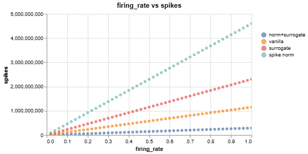
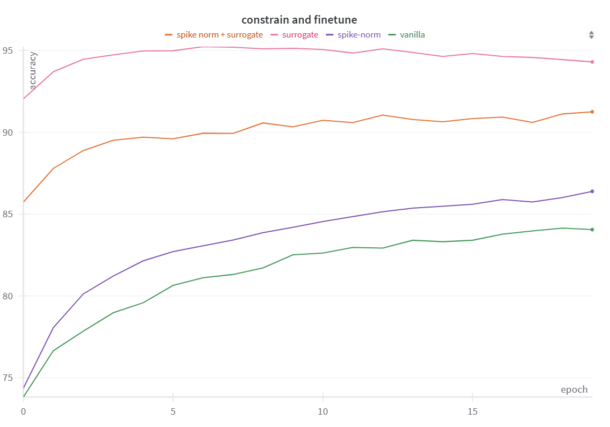

# EE 518 Neuromorphic Computing Spring 2024 Final Project
Implementation Code can be found at:https://github.com/thejackys/CSE518_AnnToSnn

neuromorphic software simulation project for converting Ann to SNN.

This project implements a Spiking Neural Network (SNN) for digit classification on the MNIST dataset. It explores the conversion of an Artificial Neural Network (ANN) to an SNN, and analyzes the impact of various factors such as firing rates, timesteps, and hardware constraints on the performance and energy consumption of the SNN.

Spike norm and surrogate gradient function are tested to see the difference in the IF_neuron. 
## Spike norm
Spike norm is Adapted from spike-norm proposed from <cite>[Going Deeper in Spiking Neural Networks: VGG and Residual Architectures][1]</cite>. The new threshold voltage for each Spiking neuron layer is set to $$v_{th} = \text{max}(v_{th}, w_0^\intercal s_0, (w_1^\intercal s_1), ..., (w_B^\intercal s_B)) $$ where $B$ is the batch size, $s_i$ is the input from the previous layer, and $w_i$ is the weight respective to $s_i$  after a whole timesteps T is has passed. In the original paper, It's effectively updated with batch size of 1.

## Surrogate gradient function
Neuron firing of the IF-neuron follows the heaviside function $$ S[t] \Theta(v_{mem}[t] - v_{th}) $$
The gradient would thus be unstable if follow the autograd directly. Thus (Surrogate Gradient Learning in Spiking Neural Networks)[https://arxiv.org/abs/1901.09948] is proposed to use surrogate function when doing backpropagation.  

Although I am still not sure about the bioplausability of it, I tested the surrogate by applying the sigmoid surrogate gradient function from [spikingjelly](https://spikingjelly.readthedocs.io/zh-cn/latest/activation_based_en/surrogate.html)


## Project Structure

- `main.py`: The main script that trains the ANN and SNN models, and runs experiments with different configurations.
- `model.py`: Contains the implementation of the ANN and SNN models, including the Poisson encoder, IF neuron, and surrogate gradient.

## Requirements

- Python 3.x
- PyTorch
- torchvision
- numpy
- wandb (for logging metrics)
- spikingjelly (for surrogate gradient)

## Usage

1. Install the required dependencies.
2. Run `main.py` to train the models and perform experiments.

## Experiments

The project conducts the following experiments:

1. Trained an ANN with 1 hidden layer (100 neurons) on the MNIST dataset for a basic accuracy
For each mode:
1. Converting the ANN to an SNN and analyzing the accuracy and energy consumption (total number of Accumulate operations) for different timesteps and firing rates.
2.  By deciding the optimal value of timesteps and firingrate, further, Incorporating hardware constraints such as resistance ON-OFF ratio of 10 and 16 discrete resistance states into the SNN model.

## Results
Best Timesteps and best firing rate based on its best timesteps are reported in the following table:
| Model                               | Best Timesteps | Average Runtime (seconds) | Best Firing Rate | Accuracy Threshold (5 epochs) | Applying constrained (20 epochs)|
|-------------------------------------|----------------|---------------------------|------------------|-------------------|-------|
| vanilla                             | 32             | 72                        | 0.46             | > 85%             |84.1% |
| spike norm                          | 128            | 240                       | 0.76             | > 82%             |86.4% |
| surrogate function                  | 64             | 200                       | 0.24             | > 96%             |94.3% |
| spike norm + surrogate function     | 8              | 55                        | 0.38             | > 90%             |91.3% |

### 1.a FCNN with hardware constraints
Baseline ANN architecture consists of a flattening layer followed by two fully connected layers with a ReLU activation function in between:
```python
class ANN(nn.Module):
    def __init__(self):
        super().__init__()
        self.flatten = nn.Flatten()
        self.FCNN = nn.Sequential(
            nn.Linear(28*28, 100, bias=False),
            nn.ReLU(),
            nn.Linear(100, 10, bias=False),
        )
```
The bias of both linear layer is set to false to fit the hardware constraint. The testing accuracy can easily achieve 97 when the activation is ReLU.


### 1.b Converting ANN to SNN

The ANN was converted to an SNN by simulating over multiple timesteps, replacing ReLUs with IF neurons, and converting input images to Poisson spike trains. The best timesteps are reported in the above graph. All these 4 graphs are generated with a maximum firing rate of 100%.

Key observations:
- Without the surrogate gradient function, the accuracy is capped at 85%
- Surprisingly, adding the surrogated can allow the accuracy to pass over 90% even if the timesteps = 1. Which is absurd to me. But maybe the probability input mostly distributed on two side(0 and 1) so it can still resemble the original input even T = 1.


*Accuracy vs Timesteps for the SNN*


*Accuracy vs Timesteps for the SNN with spike norm applied.* 


*Accuracy vs Timesteps for the SNN with surrogate gradient function applied.*


*Accuracy vs Timesteps for the SNN with both spike norm and surrogate gradient applied.*

### 1.c Varying firing rate
After deciding the optimal firing rate for each neuron models. The accuracy is tested with 50 diffrent values of firing rate (0.02,0.04,...,1). There are also some observation:
  1. Surrogate function are able to retain high accuracy even if the max firing rate is set to around .2. 
  2. adding spike norm does not help and could perform even worse.
  3. The slope for each mode could also result from timestep differences. Increasing timesteps would have a similar effect scaling down the firing rate in terms of the accuracy as the expected value of spikes per input will remain the same.


*firing rate vs accuracy for the SNN.*



*firing rate vs spikes for the SNN. The total spikings of the poisson encoder are linearly propotional to the firing_rates and the Timesteps T. The slope differences in 4 If_neuron is due to the timesteps.*


### 2 Hardware constraints

The Hardware constraints are applied between training and test process:
``` python
train(train_dataloader, model, loss_func, optimizer)
if add_constraint:
    model.apply_weight_constraints()
test(test_dataloader, model, loss_func)
```
I use a similar procedure in [Deep Compression]([2]) to optimize after applying the constraint weight. 
Retrain and apply the constraints recursively until a fixed epoch or a desired accuracy is achieved.  
#### Resistance ON-Off ratio
The resistance ON-OFF ratio constraint is enforced by clipping the weights of the first linear layer based on the specified ratio of 10:
Both poistive and negative values are clamped separated so that max and min values of positive and negative will lies in a ratio of 10.

#### Discrete states
The function `quantize_weight` mimics the hardware's discrete state nature by setting the positive and negative weights to each have 16 states of weight.    
It restricts the weights to a discrete set of values, simulating the limited precision of hardware implementations.

The image below shows the accuracy and finetuning curve after applying the hardware constraints (ON-OFF ratio and 4-bit discrete states) to the SNN model with surrogate gradient and spike norm. Each time the constraint is applied befor testing. 



As observed in the graph, the accuracy drops after applying the constraints but gradually recovers through finetuning. After 20 epochs of retraining, the accuracy approaches the level achieved without constraints. 
From the graph, we can see that both vanilla and spike-norm's accuracy are still increasing along the epochs, indicating that they have the long tailed traiing processes if no surrogate gradienct is applied.

## Disscussion
We can see that the surrogate gradient function largely improves the accuracy and the spike norm doesn't work well. 
### success of surrogate gradient function
The Success of the surrogate gradient function, as discussed earlier, is due to the fact that **heaviside function will have a 0 gradient on all place other than 0 and infinite at 0. Which may not work well in updating the weights.**
However I am not sure whether it is plausible in hardware. A further investigation is needed.
### Failure of spike norm:
The possible failure of spike norm could be due to my implementation. The norm is updated only after each batch size is forwarded and updated with max of all batches. The value will be larger and updated slower. Leading to its ineffectiveness.    


## Implementation detail
### Neuron_class
The `IF_neuron` class represents an implementation of the Integrate-and-Fire (IF) neuron model, which is a simple spiking neuron model used in Spiking Neural Networks (SNNs). Here's an explanation of the key components and functionality of the `IF_neuron` class:

The `Surrogate_IF_neuron` replaces the firing method to the surrogate gradient function from spikingjelly.

#### Initialization

- The `IF_neuron` class is initialized with two optional parameters:
 - `v_threshold`: The threshold voltage for firing (default: 1).
 - `v_reset`: The reset voltage after firing (default: 0).
- The neuron's membrane potential `self.v` is initially set to the reset voltage `v_reset`.
- The `self.v_threshold_norm` is set to negative infinity, which is used for spike normalization.

#### Forward Pass

- The `forward` method takes an input tensor and updates the neuron's state accordingly.
- If `self.v` is a float (indicating it hasn't been initialized yet), it is converted to a tensor with the same shape as the input and initialized with the reset voltage.
- The input is added to the neuron's membrane potential `self.v`, representing the integration of the input over time.
- The `fire` method is called to determine if the neuron should spike based on its membrane potential.
- If the neuron spikes, the `reset` method is called to reset the membrane potential to the reset voltage.
- The maximum value of the input is used to update `self.v_threshold_norm` for spike normalization.
- The method returns the spike output tensor.

#### Firing Mechanism

- The `fire` method computes the difference between the membrane potential `self.v` and the threshold voltage `self.v_threshold`.
- It returns a tensor where values greater than 0 are set to 1.0 (indicating a spike) and values less than or equal to 0 are set to 0.0 (indicating no spike).

#### Reset Mechanism

- The `reset` method is called when the neuron fires.
- It subtracts the threshold voltage multiplied by the spike tensor from the membrane potential `self.v`, effectively resetting the membrane potential for the spiked neurons.

#### Reinitialization and Spike Normalization

- The `reinitialize` method sets the membrane potential `self.v` back to the reset voltage `v_reset`, allowing the neuron to be reused for multiple samples.
- The `spike_normalize` method sets the threshold voltage `self.v_threshold` to the value of `self.v_threshold_norm`, which is used for spike normalization.


## Acknowledgements

- The project uses the MNIST dataset and PyTorch framework for deep learning.
- The SNN implementation is based on the concepts and techniques from the field of neuromorphic computing.
- **Spikingjelly provides an easy to read source code that I largely consulted to throughout this project. Implentation logic of the neuron may be similar to it but not directly copied from.**
- The spikingjelly library is used for implementing the surrogate gradient.


[1]: https://www.frontiersin.org/journals/neuroscience/articles/10.3389/fnins.2019.00095/full
[2]: https://arxiv.org/abs/1510.00149
